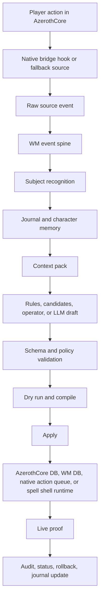

# World Master Main Design Document

Status: `REFERENCE_SYNTHESIS`  
Last updated: 2026-05-26  
Repository: `wm-project`  
Adjacent workspace basis: `D:\WOW`  

This document is a consolidated design reference for the World Master project. It was built from the current `wm-project` repository, the adjacent workspace folders, current-state handoff documents, roadmap documents, SQL bootstrap files, control contracts, native module docs, and historical root notes.

Current-state documents remain authoritative when they disagree with this synthesis. The most important current-state sources are:

- `README.md`
- `ROADMAP.md`
- `docs/README_OPERATIONS_INDEX.md`
- `docs/WM_PLATFORM_HANDOFF.md`
- `docs/WORK_SUMMARY.md`
- `docs/WORKING_STRATEGIES_V1.md`
- `docs/WM_AUTOPLAY_LLM_PLAYABILITY.md`
- `docs/CONTROL_PANEL_LM_STUDIO_V1.md`
- `docs/CONTENT_RELEASE_PIPELINE_V1.md`
- `docs/CONTEXT_PACK_V1.md`
- `docs/JOURNAL_LAYER_V1.md`
- `docs/ARC_REWARD_FACTORY_V1.md`
- `docs/adr/*.md`
- `native_modules/mod-wm-bridge/README.md`
- `native_modules/mod-wm-spells/README.md`

Some sections below describe planned architecture. Those sections are explicitly marked as `planned`, `design-only`, or `partial` where appropriate.

## 1. Executive Summary

World Master, usually abbreviated as WM, is a Python-first content, memory, and live reaction platform for a private AzerothCore 3.3.5a World of Warcraft server.

The project goal is not only to generate quests. The intended product is a per-character world master and progression engine. It observes what a player does in the world, recognizes meaningful subjects, builds persistent memory, publishes managed content, grants or mutates rewards, and can eventually steer live scenes, personal arcs, companions, abilities, rumors, oaths, patrons, nemesis relationships, and other personalized world systems.

The implementation deliberately splits responsibilities:

- Python owns planning, validation, publishing, rollback, audit, content state, character state, memory, policy, proposal review, context construction, and most product logic.
- Native C++ AzerothCore modules own low-level in-process sensing, narrow typed runtime actions, and shell-bound spell behavior.
- MySQL holds AzerothCore mechanical truth plus WM-owned audit, memory, proposal, event, bridge, spell, and runtime tables.
- The WoW client requires explicit visible truth for many changes, so client DBC/MPQ patching is treated as a separate gate from server DB state.
- Local LLM support is advisory and schema-bound. It can draft structured proposals through LM Studio, but deterministic code validates, compiles, applies, and audits.

The live source architecture has shifted over time. The current preferred live source is the repo-owned native bridge, `mod-wm-bridge`, which writes typed rows into `wm_bridge_event`.

The native action architecture has also shifted from loose command ideas toward a typed action bus. Python can enqueue approved native actions into `wm_bridge_action_request`; the native module claims, validates, executes, and writes results. Most risky verbs are disabled, unimplemented, or restricted until proven.

The spell architecture has moved away from stock spell carriers. Production WM abilities are expected to use a pre-seeded shell bank, client DBC patching, server DBC patching, and a narrow native runtime in `mod-wm-spells`. This avoids polluted stock behavior, broken pet state, cache identity problems, and invisible mismatch between client and server.

## 2. What Exists in the Workspace

The broader `D:\WOW` workspace contains the WM repository plus adjacent server, client, lab, and historical tooling.

### 2.1 Main Repository

`D:\WOW\wm-project` is the active WM repository. It is a Python package with native AzerothCore module source, SQL bootstrap files, content/control contracts, runtime scripts, panel UI, tests, and documentation.

Important top-level areas:

- `src/wm`: Python package for CLI commands, content systems, event sources, control proposals, context, journal, subjects, arcs, autoplay, panel backend, LM Studio integration, bridge lab helpers, runtime sync, publishing, and diagnostics.
- `control`: declarative contracts, schemas, recipes, policies, examples, content releases, runtime shell bank metadata, and live/manual proposal state.
- `sql`: bootstrap SQL, table definitions, migrations, bridge runtime schema, and world/character DB additions.
- `native_modules`: AzerothCore C++ module source for the native bridge, native spell runtime, and legacy prototypes.
- `scripts`: BridgeLab, DBC/client patch, runtime staging, diagnostics, test helpers, and operational scripts.
- `client_patches`: client-visible patch artifacts or patch source material, especially for WM spell shells.
- `wow_addons`: addon-side historical bridge, currently fallback/debug rather than the primary product lane.
- `data/specs`: reserved ranges, custom ID registry, feature status, and related structured reference files.
- `docs`: current-state docs, roadmap docs, ADRs, handoffs, status files, and design references.
- `tests`: unit, contract, content, event, control, panel, native payload, and integration-gated tests.

### 2.2 Adjacent Workspace Folders

The adjacent folders are important context even though they are not the main Python repository.

- `WM_BridgeLab`: a local build and runtime lab for AzerothCore plus WM native modules. BridgeLab is where native module builds, DB ports, SOAP ports, and live proofs are exercised.
- `Azerothcore_WoTLK_Rebuild`: adjacent AzerothCore rebuild tree used by the local environment.
- `Azerothcore_WoTLK_Repack`: adjacent repack/runtime material.
- `world of warcraft 3.3.5a hd`: local WoW client tree. WM client patching matters because DBC and MPQ truth must be visible to the client.
- Root historical docs such as `summary.md`, `cursor_workspace_analysis_and_project_p.md`, `DS_Roadmap_16-04v2.md`, and `STUFFv2.md`: older design reasoning that explains why the project moved toward an external Python brain, native thin bridge, strict validation, and shell-based spell lanes.
- Root lookup artifacts such as `llm_acore_lookup.md`, `llm_id_registry.json`, and `build_llm_id_registry.py`: older offline context/registry tooling for grounding LLMs or developers in AzerothCore DB data. Current WM code has more formal context-pack, subject, journal, and ID registry systems, but these root artifacts explain the original DB-grounded direction.

## 3. Product Identity

WM is best understood as a personal game-master layer built on top of AzerothCore.

The desired player experience is:

- The world reacts to what a character actually does.
- Reactions are persistent and character-specific.
- Important creatures, places, items, and events become remembered subjects.
- Small live moments can turn into arcs.
- Arcs can award exclusive or mutated items, shell abilities, reputations, companions, rumors, oath progress, titles, or scene changes.
- Progression is authored by play rather than only by static database content.
- LLM assistance can help propose language, flavor, and bounded plans, but the world changes only through deterministic validators and typed systems.

WM is not meant to be:

- A random quest spam bot.
- A pure addon system.
- A combat-log scraper as the final architecture.
- A freeform SQL executor.
- A GM command wrapper.
- A system where an LLM directly mutates the database or native runtime.
- A system that relies on stock live spell IDs as permanent carriers for custom powers.
- A UI-first project where the panel grows faster than the underlying safe runtime.

## 4. Architectural Principles

### 4.1 Python Owns Intent

Python is the main WM language and the owner of high-level decisions. Python code builds context, recognizes subjects, evaluates policies, generates and validates content artifacts, publishes rows, records audit trails, tracks rollback, manages character state, and coordinates native action requests.

The practical consequence is that complicated business logic should live in `src/wm`, not in AzerothCore hooks.

### 4.2 Native Owns Immediate Runtime Truth

Native modules handle facts and actions that must happen inside the server process:

- Sensing player events from server hooks.
- Emitting durable event rows.
- Executing narrow typed actions against live server objects.
- Implementing shell-bound spell behavior.
- Enforcing local safety checks even if Python made a mistake.

Native code should stay thin, typed, and auditable.

### 4.3 AzerothCore Tables Are Mechanical Truth

Core world and character tables remain the source of mechanical truth for WoW content and runtime state. WM does not replace AzerothCore. It layers managed artifacts, audit metadata, proposals, runtime requests, memory, and generated content state around it.

### 4.4 WM Tables Own Provenance and Memory

WM-owned tables store things AzerothCore does not model well:

- Source events.
- Derived events.
- Proposal state.
- Publish logs.
- Rollback snapshots.
- Player-subject memory.
- Character arcs and unlocks.
- Context pack logs.
- Native bridge action requests.
- Spell shell behavior metadata.
- Living-world systems.

### 4.5 LLMs Are Advisory

The LLM lane is intentionally constrained:

- The model sees curated context packs, not raw unrestricted database access.
- It returns structured drafts, not arbitrary commands.
- Pydantic and schema validation run before anything can proceed.
- Deterministic code patches in locked fields such as player GUID, source event, author, IDs, scope, and low-risk metadata.
- Dry-run gates and policy gates must pass.
- Direct apply requires explicit environment opt-in and still requires confirmation.

### 4.6 Client and Server Truth Are Separate

For visible content such as spells, icons, names, cast behavior, and item cache identity, server DB state is not enough. The WoW 3.3.5a client has local DBC/cache behavior. WM therefore treats client patching as its own deployment gate.

This matters especially for:

- Spell shells.
- Skill line rows.
- Skill race/class rows.
- Item identity changes.
- Spell visual effects.
- Icons and descriptions.
- Cached item and quest text.

### 4.7 Fresh IDs Matter

The docs repeatedly warn that failed live proofs can poison cache, saved state, pet rows, and client expectations. The working strategy is to use fresh visible IDs after bad attempts rather than repeatedly mutating the same ID and assuming the client will notice.

### 4.8 Status Labels Must Mean Something

The project uses status labels such as `WORKING`, `PARTIAL`, `BROKEN`, `UNKNOWN`, `DESIGN_ONLY`, and `PROPOSED`. The strongest practical rule is:

- `WORKING` should require live player-facing proof when the feature claims gameplay behavior.
- Passing tests, writing DB rows, or compiling code can be `repo working` while gameplay remains `partial` or `unknown`.

## 5. Major System Planes

WM has several planes that cooperate but should not be collapsed into one another.

### 5.1 Python Orchestration Plane

Location: `src/wm`

Responsibilities:

- CLI entry points.
- Configuration.
- Diagnostics.
- Event ingestion.
- Event normalization.
- Control proposal lifecycle.
- Reactive content planning.
- Content publishing.
- Quest/item/spell/artifact generation.
- Character state.
- Subject recognition.
- Journal and memory.
- Context pack construction.
- Local panel backend.
- LM Studio integration.
- Autoplay service.
- BridgeLab helpers.
- Tests and contract validation.

### 5.2 Native Bridge Plane

Location: `native_modules/mod-wm-bridge`

Responsibilities:

- Hook server-side gameplay events.
- Write `wm_bridge_event` rows.
- Maintain a small player scope mechanism.
- Execute approved `wm_bridge_action_request` rows.
- Validate action payloads in C++.
- Provide native action proof lanes.
- Keep risky actions disabled until configured and proven.

### 5.3 Native Spell Runtime Plane

Location: `native_modules/mod-wm-spells`

Responsibilities:

- Bind player-visible shell spells to WM behavior.
- Read shell/behavior/grant/debug tables.
- Avoid stock spell carrier hacks.
- Provide controlled runtime behavior for WM abilities.
- Support debug requests for lab proof.

### 5.4 Database Plane

Locations:

- `sql/bootstrap`
- `sql/native_bridge`
- `sql/spells`
- `sql/world`
- `sql/characters`

Responsibilities:

- Install WM-owned tables.
- Reserve IDs.
- Store proposals and audit logs.
- Store event logs and cursors.
- Store journal and character state.
- Store native bridge events and action requests.
- Store spell shell metadata.
- Preserve rollback snapshots.

### 5.5 Control Contract Plane

Location: `control`

Responsibilities:

- Define allowed event kinds.
- Define allowed action kinds.
- Define recipes and policies.
- Validate proposals.
- Provide examples.
- Separate manual and future LLM contract lanes.
- Prevent arbitrary SQL, shell commands, file writes, or GM command execution through content proposals.

### 5.6 Client Patch Plane

Locations:

- `client_patches`
- `scripts` DBC/MPQ tooling
- local WoW client folder

Responsibilities:

- Build and stage client-visible patch files.
- Ensure spell shells are visible to the client.
- Keep server DBC and client DBC aligned.
- Support patch deployment for `patch-z.mpq`.

### 5.7 Operator UI and LLM Plane

Locations:

- `src/wm/panel`
- `src/wm/llm`
- `src/wm/autoplay`

Responsibilities:

- Local control panel.
- Catalog and schema browsing.
- Readiness/status endpoints.
- LM Studio smoke tests and draft generation.
- Autoplay loop management.
- Manual review and apply workflow.

## 6. End-to-End Runtime Flow

The typical intended loop is:

1. A player does something in the world.
2. Native bridge or another source observes the event.
3. WM ingests the event into a normalized event spine.
4. Subject recognition identifies who or what the event is about.
5. Journal and character state provide memory.
6. Context pack construction gathers deterministic facts.
7. A rule, content lane, operator action, or LLM draft proposes a response.
8. Validation checks schema, policy, IDs, source freshness, safety, and runtime readiness.
9. Dry-run compiles or previews deterministic effects.
10. Apply publishes AzerothCore rows, WM rows, native action requests, or shell behavior metadata.
11. Runtime sync and live proof verify the player-facing result.
12. Audit and rollback records are stored.

Mermaid view:

## 7. Technology Stack

### 7.1 Language and Package Runtime

- Python 3.11 or newer.
- Package name: `wow-wm-project`.
- Import package: `wm`.
- Console entry: `wm = wm.cli:main`.
- Core dependency: `pydantic>=2.7,<3`.
- Build system: setuptools.
- Tests: pytest.

### 7.2 Python Design Style

The Python side favors:

- Small CLI modules with `main()` functions.
- Pydantic models for contracts.
- JSON files for schemas, examples, control proposals, and runtime metadata.
- Deterministic validators and compilers.
- Explicit environment variables for live DB/SOAP behavior.
- Pure stdlib where possible for local panel and scripts.

### 7.3 Database

- MySQL-compatible AzerothCore DBs.
- Common DBs:
  - `acore_world`
  - `acore_characters`
  - `acore_auth`
- WM bootstrap SQL installs additional tables into the configured DBs.
- BridgeLab often runs MySQL on explicit non-default ports, such as `33307`, to avoid colliding with other local servers.

### 7.4 AzerothCore and C++

- AzerothCore 3.3.5a server.
- Native modules written in C++.
- Main native modules:
  - `mod-wm-bridge`
  - `mod-wm-spells`
  - `mod-wm-prototypes` as legacy/broken experimental code.
- Native build and proof primarily run through the adjacent BridgeLab environment.

### 7.5 Client Data

- WoW 3.3.5a client.
- MPQ patching.
- DBC patching, especially:
  - `Spell.dbc`
  - `SkillLineAbility.dbc`
  - `SkillRaceClassInfo.dbc`
- Client patch output commonly uses `patch-z.mpq`.

### 7.6 Local UI

- Local HTTP server implemented with Python stdlib.
- Vanilla JavaScript frontend.
- Static files under `src/wm/panel/static`.
- No core requirement for React, Node, FastAPI, or external frontend tooling in the current control panel.

### 7.7 LLM Integration

- LM Studio as local model host.
- OpenAI-compatible endpoints:
  - `/v1/models`
  - `/v1/chat/completions`
- LLM code:
  - `src/wm/llm/lmstudio.py`
  - `src/wm/llm/prompts.py`
  - `src/wm/llm/results.py`
- LLM drafts are schema validated before they can be adopted.

### 7.8 Automation and Operations

- Windows batch scripts.
- PowerShell workflow.
- BridgeLab scripts for setup, build, configure, stage, start, stop, incremental rebuild, status, and proof.
- GitHub Actions run Python checks and contract validation.

## 8. Python Package Map

The `src/wm` package is broad. The following map summarizes the main subpackages and their roles.

### 8.1 `wm.cli`

The CLI dispatcher allows commands through the `wm` console script. A catalog groups known commands, but the dispatcher can run importable `wm.*` modules directly. This keeps the command surface flexible while still providing discoverability.

Command groups include:

- diagnostics
- living systems
- control
- events
- reactive systems
- content
- quests
- items
- spells
- arcs
- character
- context
- subjects
- journal
- candidate packs
- sources
- BridgeLab
- live operations
- reserved IDs

### 8.2 `wm.config`

Configuration resolves environment variables for:

- World DB.
- Character DB.
- SOAP.
- Event source configuration.
- Addon log path.
- Native bridge toggles.
- Reactive quest settings.
- Random enchant settings.
- BridgeLab directory.
- Control root and proposal state paths.

### 8.3 `wm.events`

The event spine normalizes incoming facts into a durable internal format. It works with cursors, event logs, cooldowns, reaction history, preview/run/watch flows, and source-specific adapters.

The event layer is the transition point from raw source data into WM planning data.

### 8.4 `wm.sources`

Source adapters ingest event-like information from concrete transports.

Important source lanes:

- `native_bridge`: primary live source, based on `wm_bridge_event`.
- `addon_log`: historical/fallback/debug source using addon-emitted log lines.
- `combat_log`: fallback/debug source for combat evidence.

### 8.5 `wm.control`

The control layer is the proposal and contract system. It validates events, actions, recipes, and policies. It is the boundary between "something wants to happen" and "the project is willing to apply this change".

It supports:

- Proposal validation.
- Proposal inspection.
- Dry-run.
- Apply.
- Audit.
- Registry loading.
- Policy checks.
- Native action payload contracts.

### 8.6 `wm.reactive`

Reactive systems turn recognized events into content responses. The current practical lane includes kill burst/bounty style reactions, generated or explicit templates, cooldowns, idempotency, and runtime state.

Older dynamic auto-bounty work exists but is treated carefully because stale state and cache problems can make live proof misleading.

### 8.7 `wm.content`

Content modules compile and release managed artifacts. The content release pipeline defines gates such as candidate, schema, ID reservation, draft, preflight, dry-run, apply, runtime sync, live proof, and status.

Content lanes include:

- Repeatable bounties.
- One-shot quests.
- Story arcs.
- Shell abilities.
- Managed item powers.
- Native sequence scenes.

### 8.8 `wm.quests`

Quest modules publish or manage quest artifacts. Quest publishing can write world DB rows and coordinate grant transport. Native `quest_add` is preferred when ready, with SOAP fallback available through configuration.

### 8.9 `wm.items`

Item modules handle managed items, reward items, item powers, random enchant consumables, and related content artifacts. Item work is constrained by client cache identity rules, fresh ID discipline, and explicit rollback needs.

### 8.10 `wm.spells`

Spell modules coordinate shell bank metadata, spell artifact publishing, shell behavior, grants, and runtime sync. Production spell design uses WM shell spells and native runtime support instead of stock spell carriers.

### 8.11 `wm.arcs`

Arc modules combine eligibility, quests, rewards, character state, and content publishing into personal journey content. The Arc + Reward Factory is repo/DB working but still needs full live gameplay proof for some paths.

### 8.12 `wm.character`

Character state modules model per-character profile, arcs, unlocks, reward instances, conversation steering, and prompt queues.

### 8.13 `wm.context`

Context pack modules build deterministic input bundles for planning and LLM proposal generation. A context pack can include source event, target profile, subject card, journal facts, character state, recent events, control policy, reactive runtime, and native snapshots.

### 8.14 `wm.subjects`

Subject modules identify and enrich meaningful world entities such as creatures, NPCs, zones, items, and other things that can become remembered by WM.

### 8.15 `wm.journal`

Journal modules provide player-subject memory and summary views. The journal design uses append-only event rows plus counters and summaries.

### 8.16 `wm.panel`

The panel backend serves a local UI and API for status, catalog browsing, schema discovery, jobs, drafts, LM Studio checks, readiness, markers, session state, and autoplay controls.

### 8.17 `wm.llm`

LLM modules integrate with LM Studio and define prompts, response parsing, schema handling, and result models.

### 8.18 `wm.autoplay`

Autoplay is the local no-Codex runtime loop. It watches events and chat, checks cooldowns/readiness/policies, asks LM Studio for bounded drafts when appropriate, locks deterministic fields, performs dry-run/apply where allowed, and can reply to the player through native chat-message actions.

### 8.19 `wm.bridge_lab`

BridgeLab helpers support local lab configuration, proofs, diagnostics, and coordination with the adjacent native build/runtime environment.

### 8.20 `wm.live`

Live modules support active runtime operations such as current server checks, action queue interactions, proof commands, and integration points.

### 8.21 `wm.runtime_sync`

Runtime sync modules help align generated artifacts with runtime tables and visible state.

### 8.22 `wm.reserved`

Reserved ID modules coordinate ranges and claims for generated content. This is critical because ID reuse and cache pollution can break live testing.

### 8.23 `wm.living`

Living systems cover planned or emerging gameplay concepts such as nemesis, rumors, local legends, patrons, oaths, wild catalog entries, and journal-triggered systems.

## 9. Control Contracts

The control plane is one of the project's most important safety boundaries.

### 9.1 Registry

The control registry lives under `control/registry.json`. It defines enabled recipes, schemas, policies, actions, and event types. Current enabled recipe examples include:

- `kill_burst_bounty`
- `manual_admin_action`

The default policy is `direct_apply`.

### 9.2 Event Kinds

Control event kinds include:

- `kill`
- `kill_burst_detected`
- `loot_item`
- `quest_accept`
- `quest_granted`
- `quest_completed`
- `quest_rewarded`
- `gossip_select`
- `gossip_session_expired`
- `enter_area`

These are typed facts that proposals can reference.

### 9.3 Action Kinds

Control action kinds include:

- `quest_grant`
- `quest_publish`
- `item_publish`
- `announcement`
- `noop`
- `native_bridge_action`

The action list is intentionally narrow. More dangerous or flexible actions must be added explicitly with schema, policy, and native validation.

### 9.4 Direct Apply Policy

The direct-apply policy is strict:

- Maximum one action per proposal.
- Maximum live risk is bounded.
- Source event age is limited.
- LLM direct apply requires an explicit environment gate.
- Apply requires confirmation.
- Manual admin action requires a reason.
- Arbitrary SQL is disallowed.
- Shell commands are disallowed.
- File writes are disallowed.
- Config edits are disallowed.

### 9.5 Proposal Lifecycle

A typical proposal lifecycle:

1. Draft proposal is created.
2. Schema validation runs.
3. Policy validation runs.
4. Dry-run compiles or previews.
5. Confirmation is required.
6. Apply writes controlled effects.
7. Audit and status are persisted.

Panel jobs use similar states:

- `DRAFT`
- `VALIDATED`
- `DRY_RUN_PASSED`
- `AWAITING_CONFIRM`
- `APPLIED`
- `REJECTED`
- `INVALID`
- `BROKEN`

## 10. Event and Perception Architecture

WM has evolved from file-oriented observation toward native-first event truth.

### 10.1 Native Bridge Source

The preferred current live source is `native_bridge`, backed by the `wm_bridge_event` table. The native module writes events directly from AzerothCore hooks.

Observed event families include:

- combat kill
- quest accepted
- quest granted
- quest completed
- quest rewarded
- loot item
- gossip opened
- gossip selected
- area entered
- marker aura applied
- marker aura removed

### 10.2 Addon Log Source

The addon log source remains useful for fallback, local experiments, chat bridge, and debug. The `WMBridge` addon can emit encoded lines, including player-to-WM chat events.

The autoplay playability path uses chat lines such as:

- normal messages in a custom channel named `WM`.
- `/wm <message>`, which the addon sends as a real `WM` channel message.
- `towm <message>` in normal chat channels.
- custom `WM` or `WorldMaster` channels where the prefix can be omitted.

The addon can emit hidden `WMB1|type=TOWM|...` records, which the addon-log adapter records as `wm_chat`.

### 10.3 Combat Log Source

Combat log scraping was an earlier path and remains useful for debug or fallback. It is not the desired final architecture because it is less direct, less typed, and less authoritative than native in-process hooks.

### 10.4 Event Spine

The event spine provides:

- Canonical event log.
- Event cursors.
- Cooldowns.
- Reaction history.
- Inspection.
- Preview.
- Run.
- Watch.

The design goal is that downstream planning code does not care whether the event came from native bridge, addon log, or combat log once it is normalized.

## 11. Native Bridge Design

`mod-wm-bridge` is the main native sensing/action module.

### 11.1 Responsibilities

The native bridge:

- Observes gameplay hooks.
- Emits append-only rows.
- Maintains optional player scope.
- Reads action queue rows.
- Claims action requests.
- Validates payloads.
- Executes narrow typed actions.
- Writes result status.

### 11.2 Safety Defaults

The module is designed to be inert by default.

Important safety ideas:

- Player allow-list is empty unless configured.
- Action queue is disabled unless configured.
- DB control is disabled unless configured.
- Loot observation can be disabled by default.
- Wildcard scoping is only for short debug sessions.
- C++ validates again even if Python already validated.

### 11.3 Player Scope

The bridge uses scoped player selection to avoid affecting the wrong player. Scope state can be represented through `wm_bridge_player_scope` and marker aura behavior.

The current marker aura used in docs is `946602`.

### 11.4 Action Queue

Native action requests are stored in `wm_bridge_action_request`. Queue fields support:

- expiration
- claim expiration
- purge-after windows
- priority
- sequence IDs
- sequence order
- wait-for-prior behavior

This allows Python to request typed runtime actions while C++ remains the final in-process executor.

### 11.5 Implemented and Emerging Native Actions

Implemented or current native action families include:

- `player_apply_aura`
- `player_cast_spell`
- `player_set_display_id`
- `player_remove_aura`
- `player_restore_health_power`
- `player_add_item`
- `player_remove_item`
- `player_random_enchant_item`
- `player_learn_spell`
- `player_unlearn_spell`
- `world_announce_to_player`
- `player_chat_message`
- `quest_add`
- `quest_remove`
- `player_add_money`
- `player_add_reputation`
- `creature_spawn`
- `creature_despawn`
- `creature_say`
- `creature_emote`
- `creature_cast_spell`
- `creature_set_display_id`
- `creature_set_scale`

Design and contract files list many additional action kinds that are not fully implemented or not enabled. Examples include:

- creature naming
- creature faction changes
- creature health changes
- creature movement
- creature attack
- gameobject operations
- companion operations
- title operations
- teleport
- sound
- mail
- counters
- quest objective operations
- weather

The broader native action vocabulary is intentionally ahead of implementation. Contracts and docs mention a large vocabulary, but only a subset has C++ bodies and live proof.

## 12. Native Spell and Shell Runtime

Spells are one of the hardest parts of the project because WoW spell behavior involves server data, client DBC files, caches, icons, visuals, class restrictions, skill-line rows, and native runtime behavior.

### 12.1 Why Stock Spell Carriers Were Rejected

ADR 0001 rejects stock live spell IDs as permanent carriers for production WM abilities. The reasons include:

- Stock effects leak old behavior.
- Saved pet rows can become polluted.
- Client and server can disagree.
- Reusing a known spell ID can produce misleading proof.
- It becomes hard to reason about what WM owns.

### 12.2 Shell Bank Strategy

The current strategy is:

- Pre-seed a bank of custom spell shells.
- Make those shells visible to the client through DBC/MPQ patching.
- Keep shell identity stable.
- Bind shell behavior through WM runtime metadata and native code.
- Use fresh IDs when proofs fail badly.

### 12.3 Shell Families

The current shell bank defines families such as:

- `940000-940099`: summon compatibility shells.
- `944000-944099`: passive aura compatibility shells.
- `945000-945099`: pet active compatibility shells.
- `946000-946099`: targeted projectile.
- `946100-946199`: friendly target.
- `946200-946299`: targeted effect.
- `946300-946399`: target-centered AOE.
- `946400-946499`: ground-target AOE.
- `946500-946599`: caster-centered AOE.
- `946600-946699`: self aura.
- `946700-946799`: random targets.
- `946800-946899`: passive aura.
- `946900-946999`: frontal cone.

Known shells include:

- `940001`: Bonebound Alpha/Bonebound Twins lineage.
- `946602`: watcher beacon marker.
- `946607`: field test boon.
- `946099`: Echo Restorer style shell.
- `946600`: Bonebound Echo stasis shell.
- Broug-related shells in the `946098`, `946200-946204`, `946603`, `946605`, `946620-946622`, and `946800+` ranges.
- `944000`: Jecia intellect block.

### 12.4 `mod-wm-spells`

`mod-wm-spells` is the native runtime for stable spell-shell behavior.

It uses tables such as:

- `wm_spell_shell`
- `wm_spell_behavior`
- `wm_spell_grant`
- `wm_spell_debug_request`
- `wm_spell_trigger`

The module is where shell-bound effects can become real gameplay without mutating stock spells.

### 12.5 Legacy Prototype Module

`mod-wm-prototypes` is documented as broken, legacy, and default-disabled. It should not be extended as the main spell path.

Reasons include:

- stock behavior leaks
- saved pet row pollution
- stock class summon changes
- hostile or incorrect creatures
- unisolated client-facing IDs

## 13. Content Publishing Architecture

WM treats generated content as managed artifacts, not one-off hacks.

### 13.1 Content Release Gates

The content release pipeline uses a gate model:

1. candidate
2. schema
3. ID reservation
4. draft
5. preflight
6. dry-run
7. apply
8. runtime sync
9. live proof
10. status

This gate sequence exists to prevent content from skipping validation or becoming untracked DB drift.

### 13.2 Supported Content Lanes

Current or planned content lanes include:

- repeatable bounty
- one-shot quest
- story arc
- shell ability
- item managed power
- native sequence scene

Some lanes are implemented enough for repo validation and DB staging but still need live proof before being considered fully working gameplay.

### 13.3 Quest Publishing

Quest publishing writes managed quest rows and can coordinate grant behavior.

Quest grant transport:

- Native `quest_add` is preferred when ready.
- SOAP fallback exists.
- Transport can be overridden through configuration such as `WM_QUEST_GRANT_TRANSPORT`.

Quest content must respect:

- fresh IDs after bad live attempts
- rollback snapshots
- runtime sync
- turn-in NPC truth
- objective and reward visibility
- cache behavior

### 13.4 Item Publishing

Managed item publishing supports reward items and item-power experiments. It is powerful but sensitive to cache identity.

Important item rules:

- Avoid mutating visible identity repeatedly on a cached ID.
- Use fresh IDs for major visible changes after failures.
- Keep rollback snapshots.
- Treat item effects as a separate proof lane from item existence.

### 13.5 Scene Publishing

Native sequence scenes are intended to drive live moments through approved native actions. Scene release only allows native verbs that are implemented and release-allowed. Gameobject/weather style scenes are rejected until native executors exist and are proven.

## 14. Arc and Reward Factory

The Arc + Reward Factory composes player state, quest publishing, reward publishing, and journey records.

### 14.1 Intended Role

The factory is intended to turn recognized play into personal journeys:

- detect eligibility
- choose or compile an arc beat
- publish quest content
- publish reward content
- record journey state
- sync runtime
- prove the result in-game

### 14.2 Current Status

Docs mark the arc/reward system as repo and DB working, but gameplay partial for some current examples. That means the compiler, DB writes, and status records can function, but the full accept/complete/reward loop still needs or has recently needed exact live proof for specific artifacts.

### 14.3 Known Example

One documented current scenario:

- arc: `control/examples/arcs/jecia_shadowmoon_lens_arc_v9.json`
- quest: `910171`
- item: `910013`
- target: `21059`
- turn-in NPC: `21027`

Several older IDs are explicitly retired as broken or superseded. The practical lesson is that visible proof failures should produce new IDs rather than repeated mutation of the old artifact.

## 15. Memory, Subjects, and Context

The project is moving from event reaction toward remembered world intelligence.

### 15.1 Subject Recognition

Subject recognition turns raw IDs and event facts into meaningful world subjects. A subject can be a creature, NPC, zone, item, or other recognized entity.

Subject state can include:

- definition
- enrichment
- display name
- kind
- source identity
- player-specific journal state
- event history

### 15.2 Journal Layer

The journal layer is a memory system. It uses append-only rows plus summary/counter views.

Important tables include:

- `wm_subject_definition`
- `wm_subject_enrichment`
- `wm_player_subject_journal`
- `wm_player_subject_event`
- `wm_journal_counter`
- `wm_journal_special_event`
- `wm_zone_rollup`

Current implementation includes reader, summarizer, inspect, and demo modules. Automatic subject creation, richer summarization, and LLM-assisted note generation are planned or partial.

### 15.3 Context Packs

Context packs are deterministic bundles for planning and LLM proposal generation.

A context pack can include:

- target profile
- subject card
- journal facts
- source event
- character state
- recent events
- subject events
- reactive runtime state
- control registry and policy
- latest native snapshot

The output schema is `wm.context_pack.v1`, with a `generation_input` designed for bounded proposal generation.

### 15.4 Character State

Character state tables and modules support:

- profile
- arc state
- unlocks
- reward instances
- conversation steering
- prompt queues

This is the foundation for per-character progression instead of global content generation.

## 16. LLM and Autoplay Architecture

### 16.1 Control Panel

The local control panel is a stdlib HTTP and vanilla JS application. It commonly runs on `127.0.0.1:8765`.

Panel backend areas:

- `src/wm/panel/server.py`
- `src/wm/panel/catalog.py`
- `src/wm/panel/jobs.py`
- `src/wm/panel/schemas.py`
- `src/wm/panel/state.py`
- `src/wm/panel/static`
- `src/wm/panel/schemas/catalog.json`

Panel state is stored under:

- `.wm-bootstrap/state/control-panel`

State includes:

- settings
- jobs
- drafts
- schemas
- artifacts
- session data

### 16.2 Panel API Areas

Documented endpoint families include:

- `/api/status`
- `/api/catalog`
- `/api/jobs/*`
- `/api/schemas`
- `/api/llm/*`
- `/api/drafts/*`
- `/api/wm/readiness`
- `/api/wm/markers`
- `/api/wm/session/*`
- `/api/wm/inbox`
- `/api/wm/rollback`
- `/api/wm/autoplay/*`
- `/api/wm/tools`

The current handoff says `/api/wm/session/*`, `/api/wm/inbox`, and `/api/wm/rollback` are canonical for the WM session lane, while `/api/slice/*` is compatibility-only.

### 16.3 LM Studio Draft Lifecycle

The LM Studio flow:

1. WM checks model availability.
2. WM builds a bounded prompt and context.
3. LM Studio returns text.
4. WM parses JSON.
5. WM validates schema.
6. Draft becomes `VALIDATED`, `INVALID`, or `BROKEN`.
7. A human or deterministic workflow adopts it as reviewed before dry-run.

The LLM does not directly apply changes.

### 16.4 Autoplay Runtime

Autoplay is a local no-Codex runtime loop. It can be started through:

- `start-wm-playable.bat --player-guid <guid>`
- `python -m wm.autoplay run`
- `python -m wm.autoplay status`
- `python -m wm.autoplay pause`
- `python -m wm.autoplay resume`
- `python -m wm.autoplay stop`

Autoplay behavior:

- Stores state under `.wm-bootstrap/state/autoplay`.
- Watches events for an active player.
- Handles player chat via the `WM` custom channel and `towm` fallback.
- Generates one typed draft per eligible event/cooldown.
- Locks source event and player GUID after model response.
- Runs policy gates before dry-run/apply.
- Compiles quest/item/spell drafts through existing publisher actions.
- Compiles scene/action drafts to manual-admin control proposals.
- Replies through native `player_chat_message` when allowed.

Current status is partial. The repo has the architecture and pieces, but full all-lane live proof is still pending. Shell/ability drafts remain conservative because DBC/client patching and safe restart windows are real constraints.

## 17. Database Architecture

### 17.1 Ownership Model

The database model has two ownership classes.

AzerothCore-owned tables:

- canonical world content
- character state
- auth/account data
- creature/item/quest/spell template mechanics
- runtime data the server already owns

WM-owned tables:

- event spine
- control proposals
- action queue
- subject memory
- journal data
- content artifact metadata
- rollback snapshots
- publish logs
- reserved IDs
- character arcs and unlocks
- native bridge events
- spell shell metadata
- living-world state

### 17.2 Core WM Tables

Core WM bootstrap tables include:

- `wm_event_log`
- `wm_event_cursor`
- `wm_reaction_cooldown`
- `wm_reaction_log`
- `wm_control_schema_version`
- `wm_control_proposal`
- `wm_control_apply_lock`
- `wm_reactive_quest_rule`
- `wm_player_quest_runtime_state`
- `wm_publish_log`
- `wm_rollback_snapshot`
- `wm_reserved_slot`
- `wm_reserved_id_range`

### 17.3 Subject and Journal Tables

Subject and journal tables include:

- `wm_subject_definition`
- `wm_subject_enrichment`
- `wm_player_subject_journal`
- `wm_player_subject_event`
- `wm_journal_counter`
- `wm_journal_special_event`
- `wm_zone_rollup`

### 17.4 Bridge Tables

Native bridge tables include:

- `wm_bridge_event`
- `wm_bridge_context_request`
- `wm_bridge_context_snapshot`
- `wm_bridge_player_scope`
- `wm_bridge_action_policy`
- `wm_bridge_action_request`
- `wm_bridge_world_object`
- `wm_bridge_companion`
- `wm_bridge_gossip_override`
- `wm_bridge_item_script`
- `wm_bridge_spell_intercept`
- `wm_bridge_spell_script`
- `wm_bridge_counter`
- `wm_bridge_chat_keyword`
- `wm_bridge_runtime_status`

### 17.5 Spell Runtime Tables

Spell platform tables include:

- `wm_spell_shell`
- `wm_spell_behavior`
- `wm_spell_grant`
- `wm_spell_debug_request`
- `wm_spell_trigger`

### 17.6 Character State Tables

Character progression tables include:

- `wm_character_profile`
- `wm_character_arc_state`
- `wm_character_unlock`
- `wm_character_reward_instance`
- `wm_character_conversation_steering`
- `wm_character_prompt_queue`

### 17.7 Living-System Tables

Living and planned world-intelligence tables include:

- `wm_nemesis`
- `wm_patron`
- `wm_zone_mood`
- `wm_oath`
- `wm_rumor_active`
- `wm_mentor_relationship`

### 17.8 Context, Artifact, and LLM Tables

Other WM state includes:

- `wm_llm_proposal_log`
- `wm_artifact`
- `wm_active_effect`
- `wm_context_pack_log`

## 18. ID Governance

ID governance is a core project concern because generated WoW content is only safe when IDs, cache behavior, and ownership are controlled.

### 18.1 Reserved Ranges

Current reserved range examples:

- quest: `910000-910999`
- item: `910000-910999`
- item cache escape: `919000-919999`
- spell: `947000-947999`
- gossip menu: `912000-912499`
- NPC text: `912500-912999`

The shell bank uses additional established visible shell ranges such as `940000`, `944000`, `945000`, and `946000-946999`.

### 18.2 Custom ID Registry

The custom ID registry tracks exact claims and ranges. Current registry data includes statuses across areas such as:

- creature templates
- gameobject templates
- items
- quests
- skill line ability DBC
- skill race/class DBC
- spells
- spell item enchantment DBC

It includes a mix of `WORKING`, `PARTIAL`, and `BROKEN` entries. The registry is not just documentation; it prevents accidental reuse of IDs that have live history.

### 18.3 Practical Rules

Important ID rules:

- Use reserved ranges for generated content.
- Record claims.
- Do not reuse failed visible IDs for new proof.
- Treat client cache as a real system, not a nuisance.
- Keep retired bad IDs documented.
- Separate server-only rows from client-visible rows.

## 19. Runtime and Operations

### 19.1 Setup

Typical Python setup:

- create a virtual environment
- install editable package with `pip install -e .`
- copy or edit environment configuration
- run setup/build scripts as needed
- apply WM bootstrap SQL

### 19.2 Main Diagnostics

`wm doctor` is the main high-level diagnostic lane. It checks areas such as:

- MySQL reachability
- world DB
- character DB
- WM bootstrap
- SOAP
- native bridge
- control registry

Docs show BridgeLab explicit-env profiles reaching `8/8 WORKING` in prior verification.

### 19.3 BridgeLab

BridgeLab is the local native proof environment. Common scripts include:

- `setup-bridge-lab.bat`
- `build-bridge-lab.bat`
- `configure-bridge-lab.bat`
- `stage-bridge-lab-runtime.bat`
- `start-bridge-lab-mysql.bat`
- `stop-bridge-lab-mysql.bat`
- `start-bridge-lab-all.bat`
- `incremental-bridge-lab.bat`

BridgeLab commonly uses explicit ports:

- world DB port: `33307`
- character DB port: `33307`
- SOAP port: `7879`

### 19.4 Playable Local Runtime

The local playable loop can be started with:

- `start-wm-playable.bat --player-guid <guid>`

This starts native BridgeLab watcher and addon-log watcher paths. Autoplay can then monitor events, handle chat, and route safe actions.

### 19.5 Testing

The repository uses pytest. Tests include unit tests, contract tests, content pipeline tests, panel tests, source adapter tests, and DB/bridge integration tests that are skipped unless required environment is present.

`pytest.ini` configures:

- `pythonpath=src`
- markers such as `unit`, `db_integration`, `bridge_contract`, and `content_plan`

Current docs report a previously green large suite, but live runtime status should always be checked against current code and environment.

### 19.6 CI

GitHub Actions install the package and run:

- pytest
- status validation
- native bridge contract CLI
- living catalog validation
- living catalog dry-run

CI proves repository integrity, not full gameplay behavior.

## 20. Current Status Map

This section summarizes status from current docs and structured feature status. It should be refreshed when handoff docs change.

### 20.1 Working or Strong

Reported working or repo-working areas include:

- Universal WM Session v1 for release scope.
- Event spine.
- Manual control contracts.
- Control audit.
- Stale-event policy.
- Subject resolver base.
- DB-backed journal reader fallback.
- Journal inspect.
- Personal Journey Spine V1.
- Context-pack builder.
- Seeded lab journal.
- Content workbench.
- Content release pipeline base.
- Release candidate pack.
- Local control panel base.
- Native bridge event source.
- Native action queue base.
- Native payload contracts for many action kinds.
- Managed item reward proof in at least one path.
- Random enchant consumables.
- Bone Lure.
- Combat proficiencies.
- Broug-related shell/status work.
- `wm doctor` in documented BridgeLab explicit-env profile.

### 20.2 Partial

Partial areas include:

- Autoplay plus LLM playability.
- Full live all-lane proof for LLM-generated drafts.
- Arc + Reward Factory gameplay loop for some examples.
- Some DBC-backed shell/ability drafts.
- Some scene/native action release paths.
- Control panel + LM Studio end-to-end workflow beyond smoke/draft flows.
- Native action vocabulary coverage beyond implemented C++ bodies.
- Journal V2 richness and automatic subject enrichment.
- Living systems beyond catalog/repo validation.

### 20.3 Broken or Retired

Broken, retired, or legacy areas include:

- `mod-wm-prototypes` as a production path.
- Stock spell carrier strategy for WM abilities.
- Several old quest/item/spell IDs listed in docs as retired.
- Old addon-log-first architecture as the main live transport.
- Unbounded dynamic content generation.
- Freeform LLM mutation.

### 20.4 Unknown

Some systems have repo proof or design contracts but unknown gameplay proof:

- Certain living systems.
- Some native payload contracts.
- Some future action verbs.
- Some UI/API convenience paths.
- Advanced context/memory outcomes.

## 21. Roadmap and Planned Architecture

### 21.1 North Star

The north star is a per-character World Master progression engine:

- authored-by-play personal journeys
- exclusive rewards
- unlocks
- proficiencies
- companions
- power mutations
- managed quests
- managed items
- shell spells
- deployables
- live scenes
- item-granted abilities
- procs
- runes
- enchants
- conversation steering

### 21.2 Six-Layer Strategic Model

The main roadmap describes six conceptual layers:

1. Perception: know what happened.
2. Recognition: understand what the event means.
3. Memory: remember player and subject history.
4. Planning: decide what should happen.
5. Content: materialize safe game artifacts.
6. Direction: steer world and character arcs.

### 21.3 Near-Term Priority

The recommended near-term sequence from roadmap/handoff material is:

1. Harden subject resolver.
2. Finish DB-backed Journal V2.
3. Build richer context pack generation.
4. Complete quest publish and rollback proof.
5. Prove mentor/local-legend style experiences.
6. Continue native-first event truth.
7. Keep LLM constrained to proposal mode.

### 21.4 Product Lanes

Major planned lanes:

- Personal Journey Spine.
- Arc + Reward Factory.
- Wild Powers.
- Live Scene Director.
- LLM on locked contracts.
- Companion systems.
- Oath systems.
- Patron systems.
- Nemesis systems.
- Rumor systems.
- Local legend systems.
- Conversation steering.

### 21.5 Native Expansion Plan

The native expansion design proposes batches:

- Batch 1: nemesis and hostile scene support.
- Batch 2: local legend and rewards-as-recognition.
- Batch 3: oath and hidden progress state.
- Batch 4: companions.
- Batch 5: deployables and scene objects.
- Batch 6: conversation steering.

Deferred or higher-risk native features include:

- weather
- teleport
- speed and phase manipulation
- broader gameobject control
- complex movement/AI changes

### 21.6 LLM Roadmap

LLM should become useful by being more constrained, not less constrained.

The target LLM lane:

- receives deterministic context packs
- proposes structured plans
- uses candidate packs and known schemas
- cannot mutate directly
- cannot invent uncontrolled IDs
- cannot run SQL
- cannot run shell commands
- cannot bypass dry-run
- is evaluated through deterministic validators

### 21.7 UI Roadmap

The project intentionally avoids front-loading a large UI. The panel exists to inspect, operate, and review real systems. It should grow around stable contracts, not become a parallel source of truth.

## 22. Important Design Decisions

### 22.1 No Stock Live Spell Carriers

Production WM abilities should not permanently use stock spell IDs as carriers. Use shell banks and native runtime behavior.

### 22.2 Extend Existing Action Bus

New native gameplay actions should extend the existing action bus rather than introduce a second unrelated execution path.

### 22.3 Client Shell Bank for Visible Spells

Player-facing WM spells require pre-seeded shells and client patching. Server-only rows are not enough.

### 22.4 Compiler Output Should Become the Shipped Artifact

The intended direction is that generated/compiler output becomes the real shippable quest artifact, instead of hand-cloning known-good quests as the normal path. This remains a proposed/design direction until fully proven.

### 22.5 Native-First In-Process Runtime

Hook-driven bookkeeping and effect gates should live in native C++ runtime singletons where in-process truth is required. Python remains the decision and orchestration layer.

## 23. Known Risks and Footguns

### 23.1 Client Cache and Visibility

The client may not reflect server changes if DBC, MPQ, or cache state is wrong. This can make DB proof look successful while the player sees nothing or sees stale behavior.

### 23.2 ID Reuse

Reusing failed visible IDs can preserve bad state. Fresh IDs are often cheaper than trying to reason through every cache and saved-state consequence.

### 23.3 Native Action Overreach

The native action contract vocabulary is broader than implementation. A contract existing does not mean a live-safe executor exists.

### 23.4 Addon Transport Drift

Addon logs are useful but not the final source of truth. Systems should not regress to addon-first assumptions when native bridge truth exists.

### 23.5 LLM Overreach

The fastest way to break the project is to let the LLM skip context, schema, policy, dry-run, ID reservation, or audit.

### 23.6 Stale Proposals

Source events have freshness windows. A proposal generated from stale context can affect the wrong state or feel nonsensical to the player.

### 23.7 BridgeLab Environment Mismatch

BridgeLab uses explicit ports and local paths. A command that works in one shell can fail in another if environment variables are missing.

### 23.8 Status Inflation

Repo-working and gameplay-working are different. The docs try to preserve that distinction, and future updates should keep doing so.

## 24. How the Pieces Fit Together by Example

### 24.1 Reactive Bounty Example

1. Player kills a target.
2. `mod-wm-bridge` writes a kill event.
3. WM source adapter reads the event.
4. Event spine records canonical event.
5. Reactive planner detects a kill burst or bounty opportunity.
6. Proposal is built using a recipe.
7. Control policy validates freshness and action count.
8. Dry-run previews quest publish or grant.
9. Apply writes quest rows and audit logs.
10. Grant transport uses native `quest_add` or SOAP fallback.
11. Player sees the quest.
12. Completion/reward events feed back into journal and character state.

### 24.2 Shell Ability Example

1. A managed reward grants a shell spell.
2. Server DBC and client patch already contain the shell identity.
3. WM records behavior metadata in spell runtime tables.
4. Native `mod-wm-spells` binds shell cast/aura/proc behavior.
5. Player learns or receives the shell through a controlled path.
6. Native runtime executes behavior when the player uses it.
7. WM records proof and status.

### 24.3 LLM Autoplay Chat Example

1. Player says `what should I do with this relic?` in the custom `WM` channel.
2. Addon bridge emits a hidden WM chat line.
3. Addon-log adapter records `wm_chat`.
4. Autoplay service checks active player, session, readiness, cooldown, and model config.
5. Context pack is built.
6. LM Studio returns a structured draft.
7. WM locks source event and player GUID.
8. Schema and policy validation run.
9. If it is only a reply, WM can enqueue `player_chat_message`.
10. If it proposes content, dry-run and review/apply gates determine whether anything changes.

### 24.4 Arc Reward Example

1. Journal or character state indicates a subject has become important.
2. Arc eligibility is evaluated.
3. Reward factory chooses or compiles a managed reward.
4. Quest and item IDs are reserved.
5. Quest/item artifacts are generated.
6. Preflight validates IDs, rows, references, and rollback.
7. Apply writes DB rows and WM records.
8. Runtime sync updates relevant runtime tables.
9. Player accepts/completes the quest.
10. Reward state is recorded as a character-specific milestone.

## 25. Suggested Documentation Rules Going Forward

To keep this design document useful:

- Update current-state handoff docs first after live proof.
- Update this document when architectural boundaries change.
- Keep design-only ideas marked as design-only.
- Never mark gameplay `WORKING` without player-facing proof.
- Record retired/broken visible IDs.
- Link new ADRs for major boundary changes.
- Prefer structured status files for machine-readable truth.

## 26. Source Inventory Snapshot

The repository currently contains a large Python codebase, native module source, extensive docs, and many tests. A rough inspected snapshot:

- `src/wm`: more than 300 Python files.
- `docs`: about 90 Markdown files.
- `tests`: about 170 Python test files and hundreds of test functions/classes.
- `native_modules`: C++ source, headers, SQL files, and module configs.
- `control`: JSON schemas, policies, examples, runtime shell bank metadata, and proposal material.

These counts are descriptive rather than contractual. The exact current truth should be checked with repository tools before release notes.

## 27. Glossary

WM:

World Master, the project and runtime layer.

AzerothCore:

The WoW 3.3.5a server emulator that provides the base game server.

BridgeLab:

Local native build/runtime proof environment adjacent to the repo.

Native bridge:

`mod-wm-bridge`, the C++ module for server-side event emission and typed action execution.

Shell spell:

A custom pre-seeded spell identity used as a safe visible carrier for WM-defined behavior.

Spell runtime:

`mod-wm-spells`, the native system that binds shell spells to WM behavior.

Control proposal:

A structured request for WM to do something, validated by schema and policy.

Context pack:

A deterministic planning bundle containing event, subject, journal, character, and policy facts.

Journal:

Persistent player-subject memory and summary state.

Subject:

A meaningful world entity recognized by WM, such as a creature, NPC, item, zone, or other target.

Artifact:

A generated or managed content object with provenance, such as a quest, item, shell ability, or scene.

Live proof:

Evidence that a feature works in the actual game client/server loop, not only in tests or DB rows.

## 28. Bottom Line

World Master is an external-first, Python-led world intelligence and content platform for AzerothCore. Its core value is not "LLM writes WoW content"; it is a deterministic, audited, player-specific control layer that can observe real play, remember meaning, publish safe managed artifacts, and gradually direct richer personal experiences.

The current project already has substantial foundations:

- event spine
- native bridge
- control contracts
- content release pipeline
- shell spell platform
- journal/context systems
- local panel
- LM Studio integration
- autoplay loop
- BridgeLab proof workflow
- extensive docs and tests

The remaining work is mostly about proving more end-to-end gameplay loops, strengthening memory/context systems, completing native runtime verbs, and keeping LLMs inside strict contracts while the deterministic platform becomes richer.
