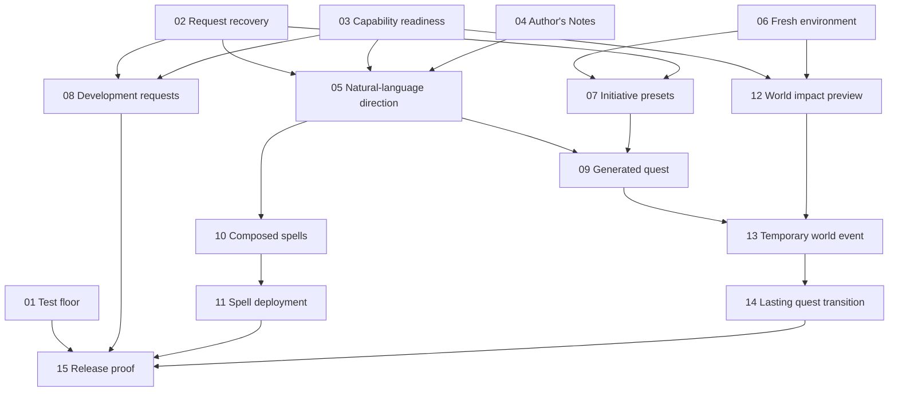

# WM Autonomous Director V1 - Work Index

Status: planning published; implementation and release proof remain incomplete.
Baseline checked: 2026-09-14 at local HEAD `5a0ee41`.

## Start Here

- September 24 design follow-up: [WM Rebuild Plan](../wm-redesign-2026-09-23/REBUILD_PLAN.md) refines architecture, early personal-play milestones and migration. Existing issue identities remain; reconcile expanded acceptance before implementation. No issue status or dependency was changed by that planning session.
- [Release specification](https://github.com/Dicetar/wow-wm-project/issues/5) is the canonical GitHub PRD.
- [Local specification](SPEC.md) and [code assessment](ASSESSMENT.md) preserve the planning baseline.
- [Agreed vocabulary](../../../CONTEXT.md) records the user decisions.
- Local ticket files below are publication snapshots. Use the linked GitHub issue for current discussion, status, and dependencies.
- Read the repo's current WM workflow, live/content skill instructions, and current-state docs before implementing a ticket. Preserve unrelated dirty work.

## Execution Order

All tickets carry the `ready-for-agent` label. Only start a ticket after its native blocking dependencies are closed with the required evidence. Ticket numbers in this table are local ordering aids; the names link to actual issues.

| Order | Ticket | Blocked by local order | Local snapshot |
| --- | --- | --- | --- |
| 01 | [Restore a reproducible full-suite and DLL-guard baseline](https://github.com/Dicetar/wow-wm-project/issues/6) | None | [Body](tickets/01.md) |
| 02 | [Recover one WM request through restart and native completion](https://github.com/Dicetar/wow-wm-project/issues/7) | None | [Body](tickets/02.md) |
| 03 | [Report which requested capabilities can actually run](https://github.com/Dicetar/wow-wm-project/issues/8) | None | [Body](tickets/03.md) |
| 04 | [Manage persistent World and Character Author's Notes](https://github.com/Dicetar/wow-wm-project/issues/9) | None | [Body](tickets/04.md) |
| 05 | [Route natural-language requests and remember standing direction](https://github.com/Dicetar/wow-wm-project/issues/10) | 02, 03, 04 | [Body](tickets/05.md) |
| 06 | [Base WM decisions on fresh environment evidence](https://github.com/Dicetar/wow-wm-project/issues/11) | None | [Body](tickets/06.md) |
| 07 | [Apply On Demand, Moderate, and Active initiative presets](https://github.com/Dicetar/wow-wm-project/issues/12) | 02, 06 | [Body](tickets/07.md) |
| 08 | [File missing-mechanic development requests automatically](https://github.com/Dicetar/wow-wm-project/issues/13) | 02, 03 | [Body](tickets/08.md) |
| 09 | [Generate and deliver a feasible quest from actual play](https://github.com/Dicetar/wow-wm-project/issues/14) | 05, 07 | [Body](tickets/09.md) |
| 10 | [Compose functioning spells from reusable tested mechanics](https://github.com/Dicetar/wow-wm-project/issues/15) | 05 | [Body](tickets/10.md) |
| 11 | [Finish generated-spell deployment and grant readiness](https://github.com/Dicetar/wow-wm-project/issues/16) | 10 | [Body](tickets/11.md) |
| 12 | [Preview shared-world changes with dependency evidence](https://github.com/Dicetar/wow-wm-project/issues/17) | 03, 06 | [Body](tickets/12.md) |
| 13 | [Run and restore a temporary world event without stranding quests](https://github.com/Dicetar/wow-wm-project/issues/18) | 09, 12 | [Body](tickets/13.md) |
| 14 | [Apply lasting quest consequences with offline catch-up](https://github.com/Dicetar/wow-wm-project/issues/19) | 13 | [Body](tickets/14.md) |
| 15 | [Prove the Autonomous Director release through full play sessions](https://github.com/Dicetar/wow-wm-project/issues/20) | 01, 08, 11, 14 | [Body](tickets/15.md) |

Independent starting work: DLL-guard/full-suite repair, durable request recovery, capability reporting, Author's Notes, and environment freshness. Start with the DLL-guard failure for the shipping floor, while independent work can proceed in separate carefully managed checkouts.

The final release gate depends on real content and continuity outcomes. No new character-specific arc is required. Existing native perception, state, publishers, shell materializers, and proof tools are reused.

## Dependency Overview

## Current Verification

- Full Python suite: **BROKEN on this host**, 1245 passed / 1 failed / 31 warnings; DLL-guard child PowerShell cannot resolve Get-FileHash.
- Skills and status validation: **WORKING**.
- Implemented product native-contract gaps: zero. Forward declarations and exempt debug kinds are not missing implemented product contracts.
- BridgeLab: **NOT READY** at planning time; DB and SOAP refused connections. Current live behavior is **UNKNOWN** for this new release.
- Local Git: main is 57 commits ahead of its recorded origin/main; no fetch, commit, push, service start, or live-game mutation was performed for this planning task.
- GitHub publication: 1 PRD, 15 child tickets, 20 native blocking relationships. The PRD remains open; no implementation ticket was closed.

## Tracker Details

[Publication manifest](publication.json) maps local files to remote issue identities for reproducible readback. The configured issue-tracker adapter uses GitHub Issues through the bundled GitHub CLI.

Native relationship references: [GitHub sub-issues API](https://docs.github.com/en/rest/issues/sub-issues) and [GitHub dependency API](https://docs.github.com/en/rest/issues/issue-dependencies). Their use here was confirmed through successful API writes and subsequent readback.

## Scope Discipline

These are build tickets, not runtime capability proof. In particular, automatic issue filing does not deploy code, shell publication does not establish combat behavior, and a justified narrative does not establish dependency-safe world changes. Carry each ticket through its listed proof before changing its status.
